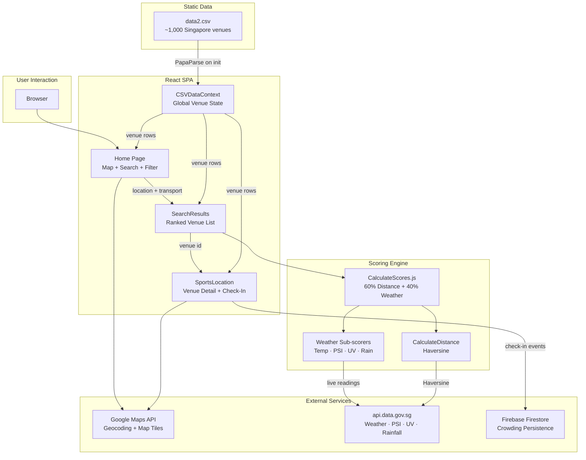

# Sportify

> A weather-aware sports venue recommender for Singapore that ranks ~1,000 facilities in real time based on proximity, live environmental conditions, and transport mode.


## What is Sportify?

Choosing where to exercise in Singapore means navigating several overlapping unknowns at once: Will it rain? Is the air quality safe today? How long will it take to get there by bus — or on foot? Answering any one of these questions takes real effort; answering all of them simultaneously is what usually kills the motivation to go.

Sportify resolves this by pulling live environmental data from Singapore's government APIs — 2-hour weather forecasts, PSI air quality readings, UV index, and rainfall measurements — and combining them with real-time distance calculations to produce a single ranked list of nearby sports facilities suited to current conditions and your chosen mode of transport. You enter your location, pick how you're getting there, and get back venues ordered by how good they are *right now*.

Beyond discovery, Sportify provides crowding awareness through a three-stage check-in system (Pre-Check-In → Check-In → Playing). This surfaces how many people are at each venue at each stage, giving users a meaningful sense of whether a court or field will be packed before they arrive.

## Key Innovations

### Exponential Distance Decay Scoring
Rather than penalizing distance linearly, Sportify uses an exponential decay function — `exp((minDistance − d) / 12000) × 100` — to score proximity. This means venues very close to you score nearly identically (small differences matter less when you're already nearby), while far venues fall off sharply. The 12,000-metre decay constant is calibrated to Singapore's urban scale, where 3 km by foot and 12 km by car represent meaningfully different effort levels. A linear model would over-penalize walkable but slightly-farther venues.

### Indoor/Outdoor Weather Sensitivity Routing
The weather scoring engine detects whether a venue's listed sports include `(indoor)` or `(outdoor)` labels, then applies a fundamentally different weighting formula for each. Indoor venues receive full immunity to rainfall and UV penalties (those factors are set to perfect scores), while only air temperature and PSI matter at reduced weight (15% each, vs. 25% each outdoors). This prevents a football stadium being down-ranked because it's raining, while correctly penalizing an outdoor tennis court for the same condition.

### Nearest-Station Spatial Interpolation for Environmental Readings
Live environmental data from `api.data.gov.sg` is reported at discrete sensor stations, not at every venue. For each venue, Sportify iterates across all active monitoring stations (up to 60 for rainfall), computes Haversine distances to find the geographically nearest sensor, and applies that station's reading as the venue's environmental value. This gives every venue a hyper-local reading derived from its actual geographic position, rather than using a single city-wide aggregate.

### SAF Work-Rest Cycle Temperature Scale
Air temperature scores are calibrated against the Singapore Armed Forces work-rest cycle thresholds — the same heat exposure guidelines used for outdoor physical activity in Singapore's humid climate. Temperatures below 24°C score 100; each degree above that steps down by 10 points, reaching 0 at 33°C. This makes the temperature penalty domain-specific and physiologically grounded rather than arbitrary.

### Three-Stage Crowding Signal via localStorage
The check-in system tracks three distinct user states — Pre-Check-In (intending to go), Check-In (arrived), Playing (actively using the venue) — with counts persisted across sessions in `localStorage`. This design avoids backend round-trips for reads and gives each user a live view of the venue state their own browser has contributed to, while Firebase Firestore stores the shared state for cross-device visibility. The state machine is frozen (`Object.freeze`) to prevent accidental mutation.

### PSI-Banded Air Quality Penalty
PSI (Pollutant Standards Index) penalties follow Singapore's official NEA health guidance bands exactly: Good (<50), Moderate (50–75), Unhealthy (76–100), Very Unhealthy (101–200), Hazardous (>200). Each band maps to a discrete score (100 → 0), so the scoring output matches what the official public health messaging tells citizens about outdoor activity risk. This avoids ad hoc thresholds in a domain where authoritative standards already exist.

## Architecture



**CSVDataContext** — loads and parses `data2.csv` via PapaParse on app init, normalises sport labels (indoor/outdoor suffixes, soccer→football), and seeds per-venue crowding state into `localStorage`.

**CalculateScores** — orchestrates parallel API calls and computes a final score per venue as a weighted sum of distance (60%) and weather (40%). Weather scoring branches on indoor/outdoor type.

**APICaller** — thin axios wrapper around five `api.data.gov.sg` endpoints. All timestamps are converted to SGT before request to avoid off-by-one timezone errors.

**SportsLocation** — venue detail page that fetches all five environmental readings independently, renders an activity-ring visualisation (UV · PSI · Air Temp), and manages the three-stage check-in state machine.

## Tech Stack

| Layer | Technology | Purpose |
|---|---|---|
| Frontend framework | React 18 | SPA with hooks-based state management |
| Routing | React Router v6 | Client-side navigation across 3 pages |
| Maps | `@react-google-maps/api` + `use-places-autocomplete` | Map rendering, geocoding, and address autocomplete |
| Data layer | PapaParse | Runtime CSV parsing of the ~1,000-venue dataset |
| Environmental APIs | Singapore Government `api.data.gov.sg` | Live weather, PSI, UV index, rainfall, temperature |
| Persistence | Firebase Firestore | Cross-device crowding data |
| Session state | `localStorage` | Per-browser check-in flags and crowding counts |
| HTTP | axios | API requests with async/await |
| Visualisation | `@jonasdoesthings/react-activity-rings` | Environmental condition rings on venue detail page |
| Build tooling | Create React App (react-scripts 5) | Dev server, bundling, and test runner |
| Testing | Jest + React Testing Library | Component tests |

## Features

- **Live venue ranking** — ~1,000 Singapore sports facilities scored in real time against current weather conditions and your starting location
- **Transport-aware distance scoring** — filter by walking, car, motorbike, or public transport; distance decay adapts to the selected modes
- **Radius slider** — narrow results to venues within 0.5 km to 50 km of your location
- **Indoor/outdoor sport detection** — venues listed as indoor are shielded from UV and rainfall penalties automatically
- **Environmental condition display** — per-venue view of current air temperature (°C), PSI, UV index, and rainfall with SAF/NEA-standard interpretation
- **Weather forecast icon** — 2-hour forecast icon shown on each venue detail page
- **Three-stage crowding system** — Pre-Check-In, Check-In, and Playing counts updated in real time via localStorage and Firebase
- **Session-persistent check-in state** — your check-in status at any venue survives page refreshes
- **Activity rings visualisation** — concentric ring chart showing UV, PSI, and temperature levels at a glance
- **Integrated map view** — Google Maps tiles with venue markers and a configurable search radius circle
- **Multi-transport route display** — directions shown on venue detail map for selected transport modes

## Future Potential

The current scoring model weights distance and weather equally across all sport types, but the next logical step is user preference learning — inferring that a specific user tolerates heat well, always walks, and only plays tennis, then personalising weights accordingly. The check-in dataset already provides the usage signal; a lightweight collaborative filter on top would make recommendations progressively sharper with use.

Sportify's environmental scoring pipeline could extend naturally to any outdoor activity planning in Southeast Asia: trail running, cycling events, open-water swimming. Integrating with Strava's API would let athletes plan sessions against the same weather-and-proximity model using their actual training routes and historical effort data. Similarly, connecting to Meetup or ActiveSG's class booking APIs would let the app surface not just venues but scheduled activities that are available right now.

The venue dataset currently covers Singapore only, but the architecture is city-agnostic — the CSVDataContext, scoring engine, and API abstraction layer would work with any city that exposes environmental sensor data on open APIs. Expansion to Malaysian cities (Kuala Lumpur, Johor) or Hong Kong's government open data platform would require a dataset refresh and API adapter, not architectural changes.

---

## Getting Started

### Prerequisites

| Tool | Version | Install |
|---|---|---|
| Node.js | 16 or later | [nodejs.org](https://nodejs.org) |
| npm | 8 or later | Included with Node.js |

You will also need two API keys — one from Google Cloud (Maps JavaScript API + Places API + Directions API) and one Firebase project. Both are free to obtain at small usage volumes.

### 1. Clone the repository

```bash
git clone https://github.com/softwarelab3/2006-SCEC-Haagen-Daz.git
cd 2006-SCEC-Haagen-Daz/sportify
```

*(Navigate into the `sportify` subfolder — all commands below run from there.)*

### 2. Install dependencies

```bash
npm install
```

*This installs React, Firebase, Google Maps wrappers, PapaParse, and all other runtime libraries listed in `package.json`.*

### 3. Configure API keys

The app currently has the Google Maps API key hardcoded in `src/components/Map/Map.js` and the Firebase config hardcoded in `src/data/fireBase/FireBase.js`. For local development you can leave these as-is if you have access to the project credentials, or replace them with your own:

**Google Maps API key** — open `src/components/Map/Map.js` and update the `googleMapsApiKey` value.

Where to get it:
1. Go to [console.cloud.google.com](https://console.cloud.google.com)
2. Create a project → APIs & Services → Enable: *Maps JavaScript API*, *Places API*, *Directions API*
3. Credentials → Create API Key → copy the key

**Firebase config** — open `src/data/fireBase/FireBase.js` and replace the `firebaseConfig` object values.

Where to get it:
1. Go to [console.firebase.google.com](https://console.firebase.google.com)
2. Create a project → Add a web app → copy the config object shown

### 4. Start the development server

```bash
npm start
```

*The app opens automatically at `http://localhost:3000`. You should see the Sportify map centred on Singapore. If the map is blank, your Google Maps API key is not yet authorised for the Maps JavaScript API.*

### 5. Build for production

```bash
npm run build
```

*Outputs a static bundle to `build/`. Serve with any static file host (Netlify, Vercel, Firebase Hosting, etc.).*

### Verify everything is working

1. Type any Singapore address into the search bar (e.g. "Bishan")
2. Click the filter icon and adjust the radius slider
3. Press Search — the Results page should appear with venues ranked by score
4. Click any venue — the detail page should display live temperature, PSI, and UV readings

---

## Development

```bash
npm start          # Dev server at http://localhost:3000 with hot reload
npm test           # Jest + React Testing Library in watch mode
npm run build      # Production bundle → build/
```

Run a single test file:

```bash
npm test -- --testPathPattern=App.test
```

## Demo

[Watch the demo video](https://youtu.be/couJMGCY0mY)

## License

Academic project — NTU SC2006 Software Engineering, AY2023/24. Team Haagen-Daz.
